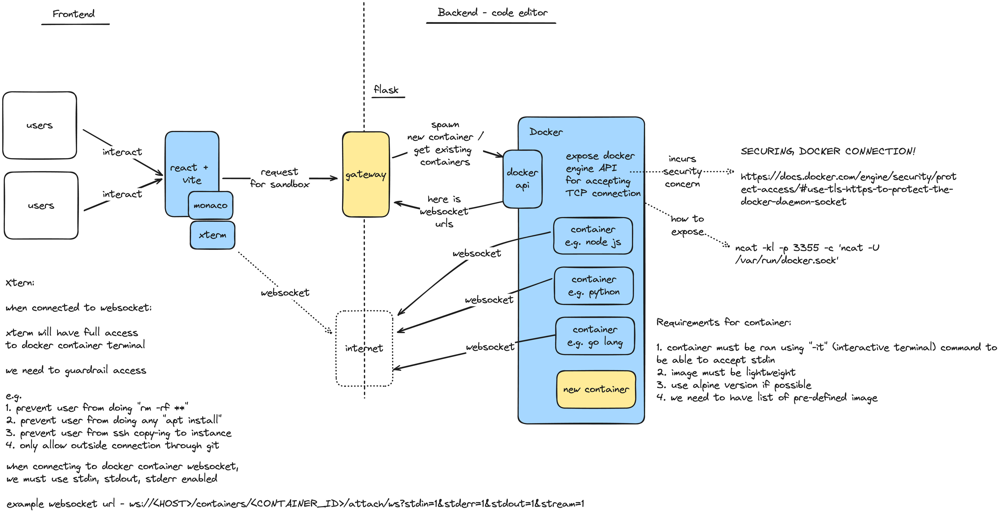

# Docker as code editor sandbox
Conceptually, Docker is a sandbox environment done through image containerization. Most importantly, Docker has an API available in their Docker Engine (Daemon) as seen in their architecture diagram below.


For code editor sandbox, we will be focusing on **utilizing Docker engine as our main interface to control the container, specifically to do these main operation: Create container and Attaching websocket to control container**. Our implementation solution is explained in more details in the [Architecture](#architecture) section below.

read more:
1. docker architecture https://docs.docker.com/guides/docker-overview/#docker-architecture
2. docker API https://docs.docker.com/engine/api/v1.46/#tag/Container/operation/ContainerAttach

## Architecture



The idea is pretty simple, let's break it down step-by-step:
1. Configure Docker Engine to expose an API accessible through HTTP (TCP)
2. Docker Engine to accept Websocket connection to control their container
3. Client (frontend) connect to Websocket through XTerm library

## Exposing Docker Engine through HTTP/TCP
By default, Docker doesn't expose their Docker Engine API publicly because of security reasons, it requires `unix socket` connections to access their API (read this concept on - docs.docker.com)

Thanks to this article, we are able to figure out on how to expose Docker Engine API publicly https://dev.to/smac89/curl-to-docker-through-sockets-1mhe

### Security concerns
as mentioned before, Docker have their consideration on why not exposing their API publicly, it has with access control

for proof of concept stage, we could expose this Docker Engine API publicly, for production level we need to put the Docker Engine behind a reverse-proxy (e.g. NGINX) and only expose the Docker Engine API locally on the machine.

we should also implement TLS to secure the connection to Docker Engine https://docs.docker.com/engine/security/protect-access/#use-tls-https-to-protect-the-docker-daemon-socket

## Connecting to Docker Container through Websocket
to connect to Docker Container through Websocket from any client is super simple and straightforward

here is how it's done:
1. the Websocket url format of the Docker Container is as follows `ws://<HOST>/containers/<CONTAINER_ID>/attach/ws?stdin=1&stderr=1&stdout=1&stream=1`
2. watch this specific line `?stdin=1&stderr=1&stdout=1&stream=1` - this is needed to tell Docker Engine that the Websocket connection are expecting and accepting `stdin` (standard input) and listening for any `stderr & stdout` (standard error & standard output). Additionally, we asked the Docker Engine API to stream the data back to client

### Xterm (Javascript lib)
If we are using Xterm as client, here is what needed to be able to connect to Docker Container easily

1. Read https://xtermjs.org/docs/api/addons/attach/
2. Install `@xterm/addon-attach` package
3. Follow code snippet below

```import { Terminal } from '@xterm/xterm';
import { AttachAddon } from '@xterm/addon-attach';

const term = new Terminal();
const socket = new WebSocket('wss://docker.example.com/containers/mycontainerid/attach/ws');
const attachAddon = new AttachAddon(socket);

// Attach the socket to term
term.loadAddon(attachAddon);
```

If you are using React as your UI framework, here is a code snippet example of a working XTerm that connected to Docker Container through Websocket
```
import { useEffect, useState, useRef } from 'react'
import { Terminal } from '@xterm/xterm'
import '@xterm/xterm/css/xterm.css'
import { AttachAddon } from '@xterm/addon-attach';

function App() {
  const term = new Terminal();
  const terminalRef = useRef<HTMLDivElement>(null);
  const effectRan = useRef(false); // Ref to track if useEffect has run

  useEffect(() => {
    if (effectRan.current) return; // Prevent running twice on non-production mode due to strict mode behavior on react
    term.open(terminalRef.current!);
    const socket = new WebSocket('ws://<DOCKER ENGINE HOST>/containers/<CONTAINER ID>/attach/ws?stdin=1&stderr=1&stdout=1&stream=1');
    const attachAddon = new AttachAddon(socket, {bidirectional: true});
    // Attach the socket to term
    term.loadAddon(attachAddon);
    effectRan.current = true; // Mark as run
  }, [])

  return (
    <>
      <div ref={terminalRef} id="terminal"></div>
    </>
  )
}

export default App
```